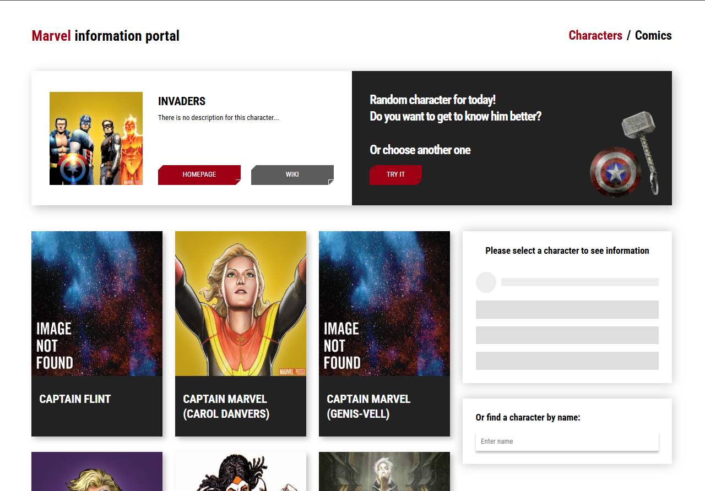
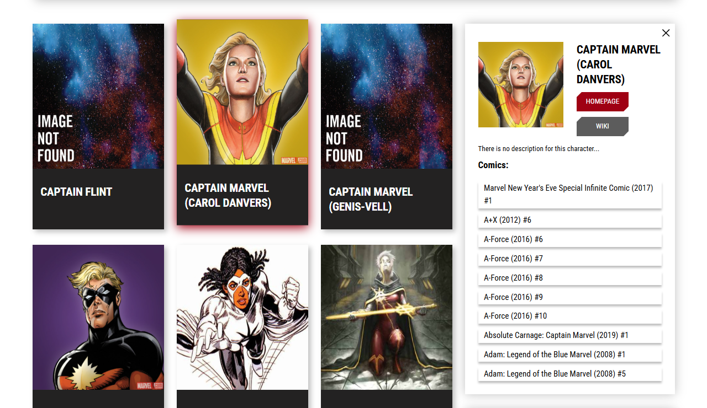
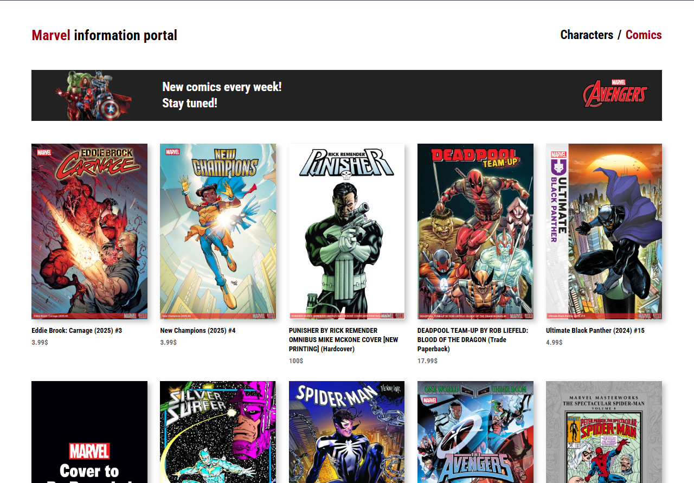
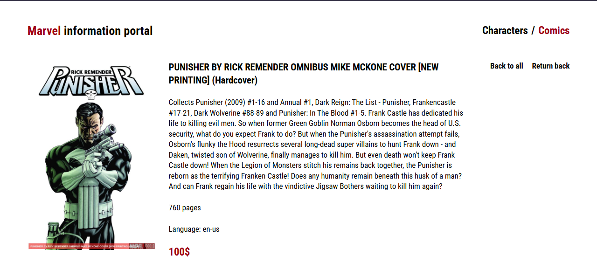

# Marvel App (React)

This is a **React-based** application that allows users to explore Marvel characters, comics, and other related content. The project utilizes the **Marvel API** to fetch and display data dynamically.

## 🚀 Features

- 📌 **Browse Marvel Characters** – View details about different Marvel superheroes and villains.
- 📖 **Explore Comics** – Get information about Marvel comics, including descriptions and covers.
- 🔍 **Search Functionality** – Find characters and comics quickly.
- ⚡ **Responsive UI** – Optimized for desktop and mobile devices.

## 🛠️ Technologies Used

- **React** – UI library
- **React Router** – For navigation
- **Marvel API** – To fetch Marvel data
- **CSS Modules / SCSS** – Styling

## 📦 Installation

1. Clone the repository:

    ```sh
    git clone https://github.com/danilfomchik/Marvel-app-react.git
    ```

2. Navigate to the project directory:

    ```sh
    cd Marvel-app-react
    ```

3. Install dependencies:

    ```sh
    npm install
    ```

4. Create a .env file in the root directory and add your Marvel API key:

    ```sh
    REACT_APP_MARVEL_API_KEY=your_api_key_here
    ```

5. Start the development server:
    ```sh
    npm start
    ```

## 📸 Screenshots
<details>
<summary>Screenshots</summary>
<br>
    
Home Page:

Selected Character:

Comics Page:

Single Comic Page:

Single Character Page:

</details>

## 📜 License

This project is licensed under the **MIT License**.

## 🙌 Acknowledgments

- **Marvel API** – For providing all the data
- **React Community** – For maintaining a great ecosystem

Feel free to contribute or open issues if you find any bugs! 🚀
